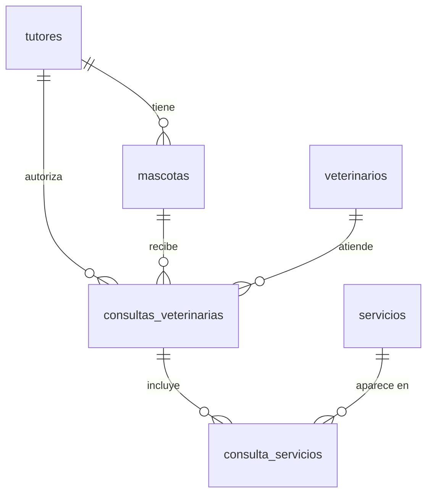

# Set 04 — Procedimientos almacenados y psql 🛠️

Tu veterinaria ya tiene un modelo sólido con 6 tablas, JOINs complejos y restricciones de
calidad. Pero cada consulta y cada inserción siguen siendo operaciones sueltas. En este set
darás el salto a **lógica que vive en el servidor**: funciones que calculan, procedimientos
que operan y la terminal `psql` para controlarlo todo sin interfaz gráfica.

> 🎯 La idea de este set: pasar de "escribir SQL" a "programar la base de datos". Las funciones
> y procedimientos almacenados son la diferencia entre una base de datos **pasiva** (solo
> guarda) y una base de datos **activa** (también procesa y valida).

> **Requisito:** haber completado los Sets 01, 02 y 03 y tener el terminal de VS Code disponible.
>
> 🛟 **Empieza ejecutando [`setup.sql`](setup.sql)**: deja la base en el estado "Set 03
> terminado" (las 6 tablas con datos completos), así arrancas desde un punto conocido.

## Ruta de aprendizaje

| # | Ejercicio | Aprendes | Tú haces |
|---|---|---|---|
| 1 | **[psql, backup y usuarios](paso1.md)** | `psql`, `pg_dump`, `psql < archivo`, `CREATE USER`, `GRANT` | Primer contacto con psql, backup en pgAdmin y terminal, restauración y usuario con permisos limitados |
| 2 | **[Tu primera función almacenada](paso2.md)** | `CREATE FUNCTION`, `RETURNS TABLE`, `\df` | Función de costo total por tutor y función de resumen de historial |
| 3 | **[Procedimiento y psql en práctica](paso3.md)** | `CREATE PROCEDURE`, `LANGUAGE plpgsql`, `CALL`, `RETURNING INTO` | Procedimiento que registra una consulta en dos tablas de una vez |

## El modelo con el que trabajas

El mismo modelo del Set 03, ya completo:



En este set no agregas tablas nuevas: agregas **lógica** encima del modelo que ya existe.

## Función vs Procedimiento: la distinción clave

```
FUNCTION  → devuelve un valor o tabla → se llama con SELECT
PROCEDURE → ejecuta acciones          → se llama con CALL
```

Ambos se guardan en el servidor y están disponibles para cualquier conexión (pgAdmin,
psql, una aplicación web). No son scripts locales: **son parte de la base de datos**.

## Cómo trabajar

1. Ejecuta [`setup.sql`](setup.sql) en pgAdmin (solo la primera vez o para reiniciar).
2. Lee cada ejercicio y escribe el SQL en el Query Tool.
3. Para los pasos de terminal, abre **Terminal → New Terminal** en VS Code.
4. Intenta resolver tú primero; si te atascas, despliega **👀 Ver solución**.

## 📤 Entrega

Cada ejercicio se entrega con tu script `.sql`, y los pasos de terminal con un `.txt`
del output. Lee las instrucciones completas en **[Entrega de los ejercicios](ENTREGA.md)**.
